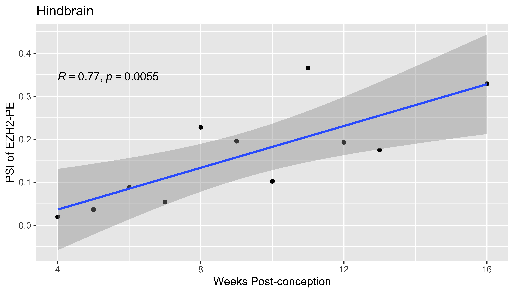
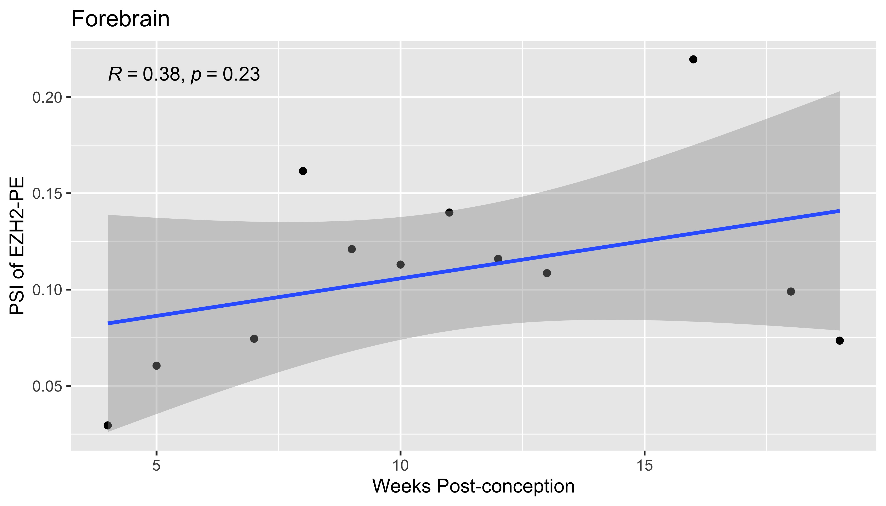

```{r setup, include=FALSE}
knitr::opts_chunk$set(echo = TRUE)
library(ggplot2)
library(dplyr)
library(ggpubr)
```

# Hindbrain

## PSI & dev time
<table>
  <tr>
    <td></td>
  </tr>
 </table>

## Gene exp & dev time
```{r, echo = FALSE, message=FALSE}
load("hindbrain_ezh2_gene_exp.RData")
hindbrain_normalized_counts %>%
  ggplot(aes(x = weeks_post_conception, y = mean_gene_exp)) +
  geom_point() +
  geom_smooth(method="lm") +
  stat_cor(method = "pearson", cor.coef.name = "R") +
  labs(title = "Hindbrain",x="Weeks Post-Conception",y="EZH2 Gene Expression")
```

## Gene exp & PSI

# Forebrain

## PSI & dev time
<table>
  <tr>
    <td></td>
  </tr>
 </table>

## Gene exp & dev time

## Gene exp & PSI