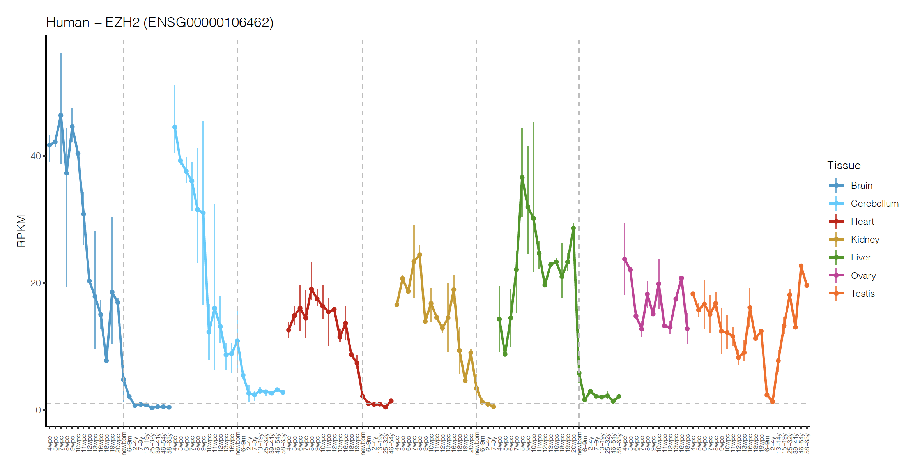
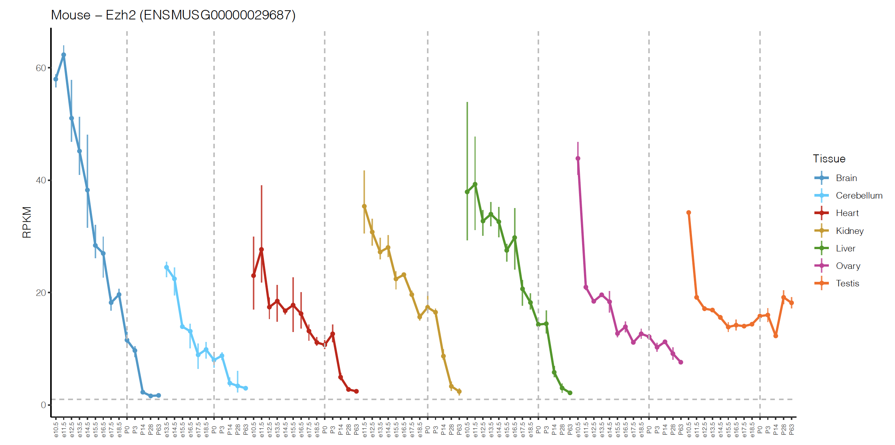

```{r setup, include=FALSE}
knitr::opts_chunk$set(echo = TRUE)
library(ggplot2)
library(dplyr)
library(ggpubr)
library(gridExtra)
library(grid)
library(cowplot)
library(reactable)
library(data.table)
library(reticulate)
library(sciplot)
```

# Coordinates
```{r COORDINATES PE, echo = FALSE}

load("~/Documents/ezh2_pe_project/ezh2_pe_coordinates.RData")

reactable(ezh2_pe_coordinates)
```
# EZH2 Expression Across Development {.tabset .tabset-pills}
Obtained from Cardoso-Moreira (2019) web-based application: http://evodevoapp.
kaessmannlab.org.

## Human
<table>
  <tr>
    <td></td>
  </tr>
 </table>

## Mouse
 <table>
  <tr>
    <td></td>
  </tr>
 </table>

## {-}

<p>&nbsp;</p>

# Mouse Neuronal Differentiation
```{r, echo = FALSE}
load("~/Documents/ezh2_pe_project/mouse_neuronal_differentation.RData")

mouse_neuronal_differentiation$condition <- as.factor(mouse_neuronal_differentiation$condition)

mouse_neuronal_differentiation <- mouse_neuronal_differentiation %>% dplyr::filter(PSI != 0) %>% 
  dplyr::filter(condition != "NPC") %>% dplyr::slice(-c(10,11)) %>%
  arrange(condition)

mouse_neuronal_differentiation$PSI <- mouse_neuronal_differentiation$PSI*100

compare_means(PSI ~ condition, data = mouse_neuronal_differentiation,paired = FALSE,p.adjust.method = "fdr", method = 'wilcox.test',method.args = list(alternative = "greater"),ref.group = "mESC") %>% dplyr::select(-".y.") %>% reactable()
```
<p>&nbsp;</p>

```{r, echo = FALSE, fig.cap="Figure 1. EZH2-PE inclusion in mESC differentiated into neurons. PSI plotted as median +/- interquartile range (n = 3). mESC = mouse embryonic stem cells; NCC = neural crest cells"}
#mouse_neuronal_differentiation %>% filter((condition != "PValue")) %>%
#  ggplot(aes(x = condition, y = PSI*100)) +
 # geom_boxplot(aes(fill=condition),show.legend = FALSE) +
 # geom_point(aes(y = PSI*100,group = condition), position = position_dodge(width = 0.75)) +
  #xlab("Condition") + ggtitle("EZH2-PE",subtitle = "") + ylab("PSI (%) ") +
  #theme(plot.title = element_text(hjust = 0.5)) +
 # stat_compare_means(comparisons = my_comparisons,label.y=c(18,20,22),method = "t.test",label = "p.format")

#data_summary <- function(x) {
 #  m <- mean(x)
 #  ymin <- m-sd(x)
 #  ymax <- m+sd(x)
 #  return(c(y=m,ymin=ymin,ymax=ymax))
#}

#se = sd(PSI,na.rm = TRUE)/sqrt(3)

#df.summary <- mouse_neuronal_differentiation%>%
 # dplyr::group_by(condition) %>%
 # summarise(
 #   se = se(PSI),
 #   PSI = mean(PSI)
#  )


df.summary <- mouse_neuronal_differentiation%>%
  dplyr::group_by(condition) %>%
  summarise(
    se = IQR(PSI),
    PSI = median(PSI)
  )

p_mouse <- ggplot(mouse_neuronal_differentiation,aes(condition,PSI)) +
  geom_jitter(position = position_jitter(0.2),color = "darkgray", size = 2) +
  geom_errorbar(aes(ymin = PSI-se, ymax=PSI+se),data=df.summary, width = 0.2,color="#0099ff") +
  geom_point(aes(x = condition,y=PSI),data=df.summary,color = "#0099ff") +
  geom_line(aes(x = condition, y= PSI, group = 1),data=df.summary, color = "#0099ff") +
  ylab("PSI (%)") + xlab("Condition") + labs(title = "EZH2-PE") +
  theme_bw() +
  theme(plot.title = element_text(hjust = 0.5,vjust = 2.5),
        axis.line = element_line(colour = "black"),
        panel.grid.major = element_blank(),
        panel.grid.minor = element_blank(),
        panel.border = element_blank(),
        panel.background = element_blank())

stat.test_mouse <- compare_means(PSI ~ condition, data = mouse_neuronal_differentiation,paired = FALSE,p.adjust.method = "fdr", method = 'wilcox.test',method.args = list(alternative = "greater"),ref.group = "mESC") %>% dplyr::select(-".y.") %>% mutate(y.position = c(18,22))

p_mouse + stat_pvalue_manual(stat.test_mouse, label = "p.adj = {p.adj}")
```
# Human iPSCs differentiated into neurons
<p>&nbsp;</p>
```{r, echo=FALSE, warning=FALSE}
load("~/Documents/ezh2_pe_project/df_burke2020_expressionANDpsi.RData")

compare_means(PSI ~ condition, data = df_burke_2020_expressionANDpsi,paired = FALSE,p.adjust.method = "fdr", method = 'wilcox.test',method.args = list(alternative = "greater"),ref.group = "iPSC") %>% dplyr::select(-".y.") %>% reactable()
```
<p>&nbsp;</p>

## Between samples

```{r, echo=FALSE,warning=FALSE,fig.cap="Figure 2. EZH2-PE inclusion in iPSCs differentiated into neurons with PSI plotted as median ± interquartile range (n ≥ 4). iPSC = induced pluripotent stem cells; NPC = neural progenitor cell; Rosette = highly organized multicellular structures derived from NPC and neuroprogenitors within rosettes differentiate into neurons. Data from Burke et al. 2020"}
#make neuron capital letter

#reorder boxplot
df_burke_2020_expressionANDpsi$condition <- factor(df_burke_2020_expressionANDpsi$condition, levels=c("iPSC","NPC","Rosette","Neuron"))

#subset_neuron <- df_burke_2020_expressionANDpsi[df_burke_2020_expressionANDpsi$condition == "neuron",]

summary_burke <- df_burke_2020_expressionANDpsi %>% na.omit() %>%
  dplyr::group_by(condition) %>%
  summarise(
    se = IQR(PSI),
    PSI = median(PSI)
  )

p_burke <- ggplot(df_burke_2020_expressionANDpsi,aes(condition,PSI)) +
  geom_jitter(position = position_jitter(0.2),color = "darkgray", size = 2) +
  geom_errorbar(aes(ymin = PSI-se, ymax=PSI+se),data=summary_burke, width = 0.2,color="#0099ff") +
  geom_point(aes(x = condition,y=PSI),data=summary_burke,color = "#0099ff") +
  geom_line(aes(x = condition, y= PSI, group = 1),data=summary_burke, color = "#0099ff") +
  ylab("PSI (%)") + xlab("Condition") + labs(title = "EZH2-PE") +
  theme_bw() +
  theme(plot.title = element_text(hjust = 0.5,vjust = 2.5),
        axis.line = element_line(colour = "black"),
        panel.grid.major = element_blank(),
        panel.grid.minor = element_blank(),
        panel.border = element_blank(),
        panel.background = element_blank())

stat.test_burke <- compare_means(PSI ~ condition, data = df_burke_2020_expressionANDpsi,paired = FALSE,p.adjust.method = "fdr", method = 'wilcox.test',method.args = list(alternative = "greater"),ref.group = "iPSC") %>% dplyr::select(-".y.") %>%
  mutate(y.position = c(45,50,55))

p_burke + stat_pvalue_manual(stat.test_burke, label = "p.adj = {p.adj}")
```
<p>&nbsp;</p>

## EZH2 expression & PE inclusion

<p>&nbsp;</p>

```{r, echo=FALSE,warning=FALSE, message=FALSE,fig.cap="Figure 3. Increasing EZH2-PE inclusion coincides with decreasing EZH2 expression. LogPSI calculated from the taking the log of the PSI(%). Data from Burke et al. 2020"}
df_burke_2020_expressionANDpsi %>%
  ggplot(aes(x = log(PSI), y = normalized_ezh2_expression)) +
  geom_point(aes(color = condition)) +
  guides(color = guide_legend(title = "Condition")) +
  geom_smooth(method="lm") +
  stat_cor(method = "spearman", cor.coef.name = "rho", label.x = 2,label.y=11000) +
  labs(title = "",x="logPSI",y="Normalized EZH2 Expression") +
  theme(plot.title = element_text(hjust = 0.5,vjust = 2.5),
        axis.line = element_line(colour = "black"),
        panel.grid.major = element_blank(),
        panel.grid.minor = element_blank(),
        panel.border = element_blank(),
        panel.background = element_blank())
```
<p>&nbsp;</p>
# Human Hindbrain(Cerebellum)
<p>&nbsp;</p>
## Across developmental time
<p>&nbsp;</p>
```{r, echo = FALSE,message=FALSE,fig.cap="Figure 4. EZH2-PE inclusion across human cerebellum development. Prenatal data are in weeks (w) postnatally, eg. 4w; neo, neonate; sch, school age (7–9 years);ya, yound adult (25-32 years); old, older adult (58 years). Data from Cardoso et al. 2019 from normal,healthy individuals/embryos"}
load("~/Documents/ezh2_pe_project/work/processed_dat/cardoso2019_hsapien_PE.RData")
load("~/Documents/ezh2_pe_project/cardoso2019_RPKM_PSI_hindbrain_hsapien.RData")

complete_cardoso2019_hsapien_hindbrain_PE %>%
  ggplot(aes(x = StandardizedStage, y = PSI)) +
  geom_point() +
  geom_smooth(method="lm") +
  stat_cor(method = "spearman", cor.coef.name = "rho",label.y = 100,label.x = 2) +
  labs(title = "EZH2-PE",x="Developmental Stage",y="PSI (%)") +
   theme(plot.title = element_text(hjust = 0.5,vjust = 2.5),
        axis.line = element_line(colour = "black"),
        panel.grid.major = element_blank(),
        panel.grid.minor = element_blank(),
        panel.border = element_blank(),
        panel.background = element_blank()) +
  scale_x_continuous(breaks = c(0,12,22,27,31), labels=c("4w","neo","sch","ya","old"))
```
<p>&nbsp;</p>
## EZH2 expression & PE inclusion
<p>&nbsp;</p>
```{r, echo = FALSE,message= FALSE, warning=FALSE,fig.cap="Figure 5. EZH2-PE inclusion increases while EZH2 expression decreases across time in human cerebellum. LogPSI calculated from the taking the log of the PSI(%). Data from Cardoso et al. 2019"}
#complete_cardoso2019_hsapien_hindbrain_PE$RealStage <- factor(complete_cardoso2019_hsapien_hindbrain_PE$RealStage, levels = c("prenatal","neonate","infant","toddler","school age child","adolescent","young adult","middle adult","older adult"))

complete_cardoso2019_hsapien_hindbrain_PE %>%
  ggplot(aes(x = log(PSI), y = EZH2_expression)) +
  geom_point(aes(color = RealStage)) +
  guides(color = guide_legend(title = "Developmental Stage")) +
  geom_smooth(method="lm") +
  stat_cor(method = "spearman", cor.coef.name = "rho", label.x = 3,label.y=51) +
  labs(title = "",x="logPSI",y="Normalized EZH2 Expression (RPKM)") +
  theme(plot.title = element_text(hjust = 0.5,vjust = 2.5),
        axis.line = element_line(colour = "black"),
        panel.grid.major = element_blank(),
        panel.grid.minor = element_blank(),
        panel.border = element_blank(),
        panel.background = element_blank())
```


```{r, echo = FALSE, message=FALSE, include =FALSE}
load("hindbrain_ezh2_gene_exp.RData")
load("se_dev.RData")
load("hindbrain_complete.RData")
gene_time_plot <- hindbrain_normalized_counts %>%
  ggplot(aes(x = weeks_post_conception, y = mean_gene_exp)) +
  geom_point() +
  geom_smooth(method="lm") +
  stat_cor(method = "pearson", cor.coef.name = "R", label.y = 4500) +
  labs(title = "",x="Weeks Post-conception",y="EZH2 Expression")
psi_time_plot <- se_dev %>%
  dplyr::filter(condition == "hindbrain") %>%
  group_by(weeks_post_conception) %>%
  mutate(mean_psi = mean(PSI)) %>%
  distinct(mean_psi, .keep_all = TRUE) %>%
  ggplot(aes(x = weeks_post_conception, y = mean_psi)) +
  geom_point() +
  labs(title = "", x = "Weeks Post-conception", y="EZH2-PE PSI") +
  geom_smooth(method="lm") +
  stat_cor(method = "pearson", cor.coef.name = "R")
gene_psi_plot <- hindbrain_complete %>%
  ggplot(aes(x = mean_psi, y = mean_gene_exp)) +
  geom_point() +
  geom_smooth(method="lm") +
  stat_cor(method = "pearson", cor.coef.name = "R", label.y = 4500) +
  labs(title = "",x="EZH2-PE PSI",y="EZH2 Expression")

plot_grid(gene_time_plot,psi_time_plot,gene_psi_plot,labels = "AUTO")

#figure <- ggarrange(h, g, ncol = 2, nrow = 1)
#annotate_figure(figure,bottom = textGrob("Weeks Post-conception", gp = gpar(cex = 1.0)))
```

```{r, echo = FALSE, message=FALSE, include=FALSE}
load("se_dev.RData")
load("forebrain_complete.RData")
load("complete_forebrain.RData")
fore_gene_time_plot <- forebrain_normalized_counts %>%
  ggplot(aes(x = weeks_post_conception, y = mean_gene_exp)) +
  geom_point() +
  geom_smooth(method="lm") +
  stat_cor(method = "pearson", cor.coef.name = "R",label.y = 5000) +
  labs(title = "",x="Weeks Post-conception",y="EZH2 Expression")
fore_psi_time_plot <- se_dev %>%
  dplyr::filter(condition == "forebrain") %>%
  group_by(weeks_post_conception) %>%
  mutate(mean_psi = mean(PSI)) %>%
  distinct(mean_psi, .keep_all = TRUE) %>%
  ggplot(aes(x = weeks_post_conception, y = mean_psi)) +
  geom_point() +
  labs(title = "", x = "Weeks Post-conception", y="EZH2-PE PSI") +
  geom_smooth(method="lm") +
  stat_cor(method = "pearson", cor.coef.name = "R")
fore_gene_psi_plot <- complete_forebrain %>%
  ggplot(aes(x = mean_psi, y = mean_gene_exp)) +
  geom_point() +
  geom_smooth(method="lm") +
  stat_cor(method = "pearson", cor.coef.name = "R", label.y = 5000) +
  labs(title = "",x="EZH2-PE PSI",y="EZH2 Expression")

plot_grid(fore_gene_time_plot,fore_psi_time_plot,fore_gene_psi_plot,labels = "AUTO")
```

```{r, echo = FALSE,include=FALSE}
load("~/Documents/ezh2_pe_project/paired_brain_wks.RData")

stat.test <- compare_means(mean_psi ~ condition, data = paired_fore_hind_brain,paired = TRUE,p.adjust.method = "fdr", method = 't.test') 

compare_means(mean_psi ~ condition, data = paired_fore_hind_brain,paired = TRUE,p.adjust.method = "fdr", method = 't.test') %>% dplyr::select(-".y.") %>%
  reactable()

p <- ggplot(paired_fore_hind_brain, aes(x = condition, y = mean_psi*100)) +
  geom_boxplot(aes(fill = condition),show.legend = FALSE) +
  geom_point(aes(y = mean_psi*100,group = condition), position = position_dodge(width = 0.75)) + 
  geom_line(aes(group = weeks_post_conception, color = as.factor(weeks_post_conception))) +
  xlab("Condition") +
  ylab("PSI (%)") + 
  theme() + guides(color=guide_legend(title="Wks post-conception"))
  

p + stat_pvalue_manual(stat.test, y.position = 45, label = "p.adj = {p.adj}", position = position_dodge(0.8))

```

